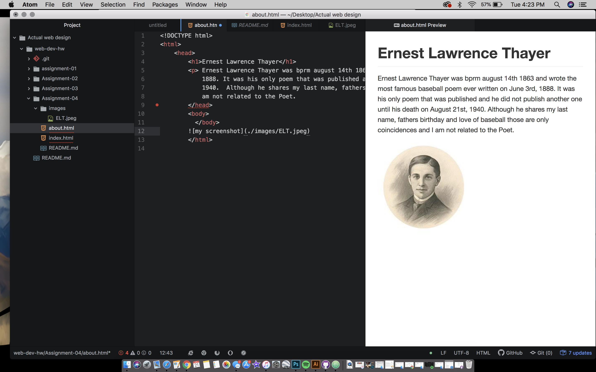

I visited Youtube.com and 2019 version of the website looks more updated and less clunky. Everything is smooth and looks more fluid from a cosmetic standpoint. I had a tough time using GIT Module, and eventually I think I was able to get everything to work relatively well but I do not know what I did on the times it worked and the times it did not. I believe coding is a very trial and error based process so I'll stick with trying until I figure everything out.

